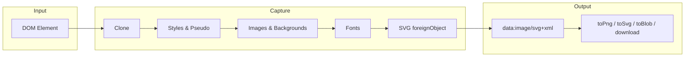

<p align="center">
  <a href="http://zumerlab.github.io/snapdom">
    
  </a>
</p>

<p align="center">
 <a href="https://www.npmjs.com/package/@zumer/snapdom">
    
  </a>
  <a href="https://www.npmjs.com/package/@zumer/snapdom">
    
  </a>
  <a href="https://github.com/zumerlab/snapdom/graphs/contributors">
    
  </a>
  <a href="https://github.com/zumerlab/snapdom/stargazers">
    
  </a>
  <a href="https://github.com/zumerlab/snapdom/network/members">
    
  </a>
  <a href="https://github.com/sponsors/tinchox5">
    
  </a>

  <a href="https://github.com/zumerlab/snapdom/blob/main/LICENSE">
    
  </a>
</p>
<p align="center"><a href="README.md">English</a> | 简体中文</p>

# snapDOM

**SnapDOM** 是新一代的 **DOM 捕获引擎（DOM Capture Engine）**——超高速、模块化、可扩展。  
它可以将任意 DOM 子树转换为自包含的结构，并导出为 SVG、PNG、JPG、WebP、Canvas、Blob，或通过插件系统生成 **任何自定义格式**。

SnapDOM 会保留样式、字体、背景图像、伪元素、Shadow DOM 等所有视觉特性，并通过可扩展的架构实现强大的灵活性和最高级别的捕获质量。


* 完整的 DOM 捕获
* 内嵌样式、伪元素和字体
* 导出为 SVG、PNG、JPG、WebP、`canvas` 或 Blob
* ⚡ 超快速度，无依赖
* 100% 基于标准 Web API
* 支持同源 `iframe`
* 支持 CSS counter() 和 CSS counters()
* 支持 `...` 文本截断（line-clamp）

## 演示

[https://snapdom.dev](https://snapdom.dev)


## 快速开始

**一行代码将任意 DOM 元素导出为 PNG：**

```js
import { snapdom } from '@zumer/snapdom';

const img = await snapdom.toPng(document.querySelector('#card'));
document.body.appendChild(img);
```

**可复用捕获**（一次克隆，多次导出）：

```js
const result = await snapdom(document.querySelector('#card'));
await result.toPng();      // → HTMLImageElement
await result.toSvg();      // → SVG 图片
await result.download({ format: 'jpg', filename: 'card.jpg' });
```

---

## 捕获流程

SnapDOM 将 DOM 元素按以下阶段转换：



| 阶段 | 说明 |
|------|------|
| **Clone** | 深度克隆，含样式、Shadow DOM、iframe。排除/过滤节点。 |
| **Styles & Pseudo** | 将 `::before`/`::after` 内联为元素，解析 `counter()`/`counters()`。 |
| **Images & Backgrounds** | 拉取并内联外部图片/背景为 data URL。 |
| **Fonts** | 嵌入 `@font-face`（可选）及图标字体。 |
| **SVG** | 将克隆包裹在 `<foreignObject>` 中，序列化为 `data:image/svg+xml`。 |
| **Export** | 转换为 PNG/JPG/WebP/Blob 或触发下载。 |

插件钩子顺序：`beforeSnap` → `beforeClone` → `afterClone` → `beforeRender` → `afterRender` → `beforeExport` → `afterExport`。


## 目录

- [快速开始](#快速开始)
- [捕获流程](#捕获流程)
- [安装](#安装)
  - [NPM / Yarn (稳定版)](#npm--yarn-稳定版)
  - [NPM / Yarn (开发版)](#npm--yarn-开发版)
  - [CDN (稳定版)](#cdn-稳定版)
  - [CDN (开发版)](#cdn-开发版)
- [构建产物](#构建产物与摇树优化)
- [用法](#基本用法)
  - [可复用的捕获](#可复用的捕获)
  - [一步式快捷方法](#一步式快捷方法)
- [API](#api)
  - [snapdom(el, options?)](#snapdomel-options)
  - [快捷方法](#快捷方法)
- [选项](#选项)
  - [`` 加载失败时的备用图片](#img-加载失败时的备用图片)
  - [尺寸 (`scale`, `width`, `height`)](#尺寸-scale-width-height)
  - [跨域图片和字体 (`useProxy`)](#跨域图片和字体-useproxy)
  - [字体](#字体)
    - [embedFonts](#embedfonts)
    - [localFonts](#localfonts)
    - [iconFonts](#iconfonts)
    - [excludeFonts](#excludefonts)
  - [节点过滤：`exclude` vs `filter`](#节点过滤-exclude-vs-filter)
  - [outerTransforms](#outertransforms)
  - [outerShadows](#outerShadows)
  - [缓存控制](#缓存控制)
- [preCache](#precache--可选辅助函数)
- [插件（测试版）](#插件测试版)
  - [注册插件](#注册插件)
  - [插件生命周期钩子](#插件生命周期钩子)
  - [上下文对象](#上下文对象)
  - [通过插件自定义导出](#通过插件自定义导出)
  - [示例：叠加滤镜插件](#示例叠加滤镜插件)
  - [完整插件模板](#完整插件模板)
- [限制](#限制)
- [⚡ 性能基准测试（Chromium）](#性能基准测试chromium)
  - [简单元素](#简单元素)
  - [复杂元素](#复杂元素)
  - [运行基准测试](#运行基准测试)
- [路线图](#路线图)
- [开发](#开发)
- [贡献者 🙌](#贡献者)
- [💖 赞助者](#赞助者)
- [Star 历史](#star-历史)
- [许可证](#许可证)


## 安装

### NPM / Yarn (稳定版)

```bash
npm i @zumer/snapdom
yarn add @zumer/snapdom
```

### NPM / Yarn (开发版)

想要提前体验新功能和修复：

```bash
npm i @zumer/snapdom@dev
yarn add @zumer/snapdom@dev
```

⚠️ `@dev` 标签通常包含在正式发布前的改进，但可能不够稳定。

### CDN (稳定版)

```html
<!-- 压缩的 构建 -->
<script src="https://unpkg.com/@zumer/snapdom/dist/snapdom.js"></script>

<!-- ES 模块构建 -->
<script type="module">
  import { snapdom } from "https://unpkg.com/@zumer/snapdom/dist/snapdom.mjs";
</script>
```

### CDN (开发版)

```html
<!-- 压缩的 UMD 构建（开发版） -->
<script src="https://unpkg.com/@zumer/snapdom@dev/dist/snapdom.js"></script>

<!-- ES 模块构建（开发版） -->
<script type="module">
  import { snapdom } from "https://unpkg.com/@zumer/snapdom@dev/dist/snapdom.mjs";
</script>
```


## 构建产物

| 变体 | 文件 | 使用场景 |
|------|------|----------|
| **ESM**（可摇树） | `dist/snapdom.mjs` | 打包工具（Vite、webpack），`import` |
| **IIFE**（全局） | `dist/snapdom.js` | script 标签、传统 `require` |

**打包工具 (npm)：**
```js
import { snapdom } from '@zumer/snapdom';  // → dist/snapdom.mjs
```

**script 标签 (CDN)：**
```html
<script src="https://unpkg.com/@zumer/snapdom/dist/snapdom.js"></script>
<script> snapdom.toPng(document.body).then(img => document.body.appendChild(img)); </script>
```

**子路径导入**（仅需部分功能时可减小体积）：
```js
import { preCache } from '@zumer/snapdom/preCache';
import { plugins } from '@zumer/snapdom/plugins';
```


## 基本用法

| 模式 | 适用场景 |
|------|----------|
| **可复用** `snapdom(el)` | 一次克隆 → 多次导出（PNG + JPG + 下载）。 |
| **快捷** `snapdom.toPng(el)` | 单次导出，代码更简洁。 |

### 可复用的捕获

一次捕获，多次导出（不会重新克隆）：

```js
const el = document.querySelector('#target');
const result = await snapdom(el);

const img = await result.toPng();
document.body.appendChild(img);
await result.download({ format: 'jpg', filename: 'my-capture.jpg' });
```

### 一步式快捷方法

直接导出单一格式：

```js
const png = await snapdom.toPng(el);
const blob = await snapdom.toBlob(el);
document.body.appendChild(png);
```

## API

### `snapdom(el, options?)`

返回一个包含可复用导出方法的对象：

```js
{
  url: string;
  toRaw(): string;
  toImg(): Promise<HTMLImageElement>; // 已废弃 
  toSvg(): Promise<HTMLImageElement>;
  toCanvas(): Promise<HTMLCanvasElement>;
  toBlob(options?): Promise<Blob>;
  toPng(options?): Promise<HTMLImageElement>;
  toJpg(options?): Promise<HTMLImageElement>;
  toWebp(options?): Promise<HTMLImageElement>;
  download(options?): Promise<void>;
}
```

### 快捷方法

| 方法                         | 描述                       |
| ------------------------------ | --------------------------------- |
| `snapdom.toImg(el, options?)`  | 返回一个 SVG `HTMLImageElement`（已废弃） |
| `snapdom.toSvg(el, options?)`  | 返回一个 SVG `HTMLImageElement` |
| `snapdom.toCanvas(el, options?)` | 返回一个 `Canvas`               |
| `snapdom.toBlob(el, options?)` | 返回一个 SVG 或光栅 `Blob`   |
| `snapdom.toPng(el, options?)`  | 返回一个 PNG 图片               |
| `snapdom.toJpg(el, options?)`  | 返回一个 JPG 图片               |
| `snapdom.toWebp(el, options?)` | 返回一个 WebP 图片              |
| `snapdom.download(el, options?)` | 触发下载              |

### 导出器专用选项

除了全局的捕获选项之外，部分导出器还支持一小组 **仅用于导出** 的选项。

#### `download()`

| Option     | Type                                          | Default   | Description |
| ---------- | --------------------------------------------- | --------- | ----------- |
| `filename` | `string`                                      | `snapdom` | 下载文件名。      |
| `format`   | `"png" \| "jpeg" \| "jpg" \| "webp" \| "svg"` | `"png"`   | 下载文件的输出格式。  |

**示例：**

```js
await result.download({
  format: 'jpg',
  quality: 0.92,
  filename: 'my-capture'
});
```

#### `toBlob()`

| Option | Type                                          | Default | Description  |
| ------ | --------------------------------------------- | ------- | ------------ |
| `type` | `"svg" \| "png" \| "jpeg" \| "jpg" \| "webp"` | `"svg"` | 生成的 Blob 类型。 |

**示例：**

```js
const blob = await result.toBlob({ type: 'jpeg', quality: 0.92 });
```


## 选项

所有捕获方法都接受一个 `options` 对象：


| 选项            | 类型     | 默认值  | 描述                                     |
| ----------------- | -------- | -------- | ----------------------------------------------- |
| `fast`            | boolean  | `true`   | 跳过小的空闲延迟以获得更快的结果      |
| `embedFonts`      | boolean  | `false`  | 内嵌非图标字体（图标字体始终内嵌）   |
| `localFonts`      | array    | `[]`     | 本地字体 `{ family, src, weight?, style? }`  |
| `iconFonts`       | string\|RegExp\|Array | `[]` | 额外的图标字体匹配器                      |
| `excludeFonts`    | object   | `{}`     | 在嵌入时排除字体族/域名/子集 |
| `scale`           | number   | `1`      | 输出缩放倍数                         |
| `dpr`             | number   | `devicePixelRatio` | 设备像素比                     |
| `width`           | number   | -        | 输出宽度                                    |
| `height`          | number   | -        | 输出高度                                   |
| `backgroundColor` | string   | `"#fff"` | JPG/WebP 的备用颜色                     |
| `quality`         | number   | `1`      | JPG/WebP 的质量（0 到 1）                   |
| `useProxy`        | string   | `''`     | CORS 备用代理基础 URL                   |
| `exclude`         | string[] | -        | 要排除的 CSS 选择器                        |
| `excludeMode`     | `"hide"`\|`"remove"` | `"hide"` | `exclude` 的应用方式                  |
| `filter`          | function | -        | 自定义谓词函数 `(el) => boolean`              |
| `filterMode`      | `"hide"`\|`"remove"` | `"hide"` | `filter` 的应用方式                   |
| `cache`           | string   | `"soft"` | `disabled` \| `soft` \| `auto` \| `full`        |
| `placeholders`    | boolean  | `true`   | 为图片/CORS iframe 显示占位符       |
| `fallbackURL`     | string \| function  | - | `` 加载失败时的备用图片 |
| `outerTransforms`      | boolean  | `true`  | 当为 `false` 时移除 `translate/rotate` 但保留 `scale/skew`，产生扁平、可复用的捕获 |
| `outerShadows`       | boolean  | `false`  | 不为根元素的阴影/模糊/轮廓扩展边界框，并从克隆的根元素中移除这些视觉效果 |

### `` 加载失败时的备用图片

为失败的 `` 加载提供默认图片。您可以传递一个固定 URL 或一个接收测量尺寸并返回 URL 的回调函数（便于生成动态占位符）。

```js
// 1) 固定 URL 备用
await snapdom.toSvg(element, {
  fallbackURL: '/images/fallback.png'
});

// 2) 通过回调生成动态占位符
await snapdom.toSvg(element, {
  fallbackURL: ({ width: 300, height: 150 }) =>
    `https://placehold.co/${width}x${height}`
});

// 3) 使用代理（如果您的备用图片主机没有 CORS）
await snapdom.toSvg(element, {
  fallbackURL: ({ width = 300, height = 150 }) =>
    `https://dummyimage.com/${width}x${height}/cccccc/666.png&text=img`,
  useProxy: 'https://proxy.corsfix.com/?'
});
```

注意：
- 如果备用图片也加载失败，snapDOM 会用保留宽度/高度的占位符块替换 ``。
- 回调使用的宽度/高度从原始元素（dataset、style/attrs 等）中收集（如果可用）。

### 尺寸 (`scale`, `width`, `height`)

* 如果提供了 `scale`，它将**优先于** `width`/`height`。
* 如果只提供 `width`，高度按比例缩放（反之亦然）。
* 同时提供 `width` 和 `height` 会强制使用精确尺寸（可能会失真）。

### 跨域图片和字体 (`useProxy`)

默认情况下，snapDOM 尝试使用 `crossOrigin="anonymous"`（或同源时使用 `use-credentials`）。如果资源被 CORS 阻止，您可以将 `useProxy` 设置为转发实际 `src` 的前缀 URL：

```js
await snapdom.toPng(el, {
  useProxy: 'https://proxy.corsfix.com/?' // 注意：可以使用任何 CORS 代理 'https://proxy.corsfix.com/?'
});
```


* 代理仅用作**备用**；同源和启用 CORS 的资源会跳过它。

### 字体

#### `embedFonts`
当为 `true` 时，snapDOM 会嵌入在捕获子树中检测到使用的**非图标** `@font-face` 规则。图标字体（Font Awesome、Material Icons 等）**始终**被嵌入。

#### `localFonts`
如果您自己提供字体或拥有 data URL，可以在此处声明它们以避免额外的 CSS 发现：

```js
await snapdom.toPng(el, {
  embedFonts: true,
  localFonts: [
    { family: 'Inter', src: '/fonts/Inter-Variable.woff2', weight: 400, style: 'normal' },
    { family: 'Inter', src: '/fonts/Inter-Italic.woff2', style: 'italic' }
  ]
});
```

#### `iconFonts`
添加自定义图标字体族（名称或正则表达式匹配器）。对私有图标集很有用：

```js
await snapdom.toPng(el, {
  iconFonts: ['MyIcons', /^(Remix|Feather) Icons?$/i]
});
```

#### `excludeFonts`
跳过特定的非图标字体以加快捕获速度或避免不必要的下载。

```js
await snapdom.toPng(el, {
  embedFonts: true,
  excludeFonts: {
    families: ['Noto Serif', 'SomeHeavyFont'],     // 按字体族名称跳过
    domains: ['fonts.gstatic.com', 'cdn.example'], // 按源主机跳过
    subsets: ['cyrillic-ext']                      // 按 unicode-range 子集标签跳过
  }
});
```
*注意*
- `excludeFonts` 仅适用于**非图标**字体。图标字体始终被嵌入。
- `families` 的匹配不区分大小写。主机通过子字符串与解析后的 URL 进行匹配。


#### 节点过滤：`exclude` vs `filter`

* `exclude`: 通过**选择器**移除。
* `excludeMode`: `hide` 对排除的节点应用 `visibility:hidden` CSS 规则，布局保持原样。`remove` 完全不克隆排除的节点。
* `filter`: 每个元素的高级谓词函数（返回 `false` 以丢弃）。
* `filterMode`: `hide` 对过滤的节点应用 `visibility:hidden` CSS 规则，布局保持原样。`remove` 完全不克隆过滤的节点。

**示例：过滤掉 `display:none` 的元素：**
```js
/**
 * 示例过滤器：跳过 display:none 的元素
 * @param {Element} el
 * @returns {boolean} true = 保留, false = 排除
 */
function filterHidden(el) {
  const cs = window.getComputedStyle(el);
  if (cs.display === 'none') return false;
  return true;
}

await snapdom.toPng(document.body, { filter: filterHidden });
```

**使用 `exclude` 的示例：** 通过选择器移除横幅或工具提示
```js
await snapdom.toPng(el, {
  exclude: ['.cookie-banner', '.tooltip', '[data-test="debug"]']
});
```

### outerTransforms 

捕获旋转或平移的元素时，如果您想消除这些外部变换，可以使用 **outerTransforms: false** 选项。这样，输出是**扁平、直立且可直接**在其他地方使用的。

- **`outerTransforms: true (默认)`**  
  **保留原始的 `transforms` 和 `rotate`**。  
  

### outerShadows
- **`outerShadows: false (默认)`**  
  防止为根元素的阴影、模糊或轮廓扩展边界框，并从克隆的根元素中移除 `box-shadow`、`text-shadow`、`filter: blur()/drop-shadow()` 和 `outline`。  

> 💡 **提示：** 同时使用两者（`outerTransforms: false` + `outerShadows: false`）会产生严格、最小化的边界框，没有视觉溢出。

**示例**

```js
// outerTransforms 和移除阴影溢出
await snapdom.toSvg(el, { outerTransforms: true, outerShadows: true });
```

## 缓存控制

SnapDOM 为图片、背景、资源、样式和字体维护内部缓存。
您可以使用 `cache` 选项控制它们在捕获之间的清除方式：

| 模式        | 描述                                                                 |
| ----------- | --------------------------------------------------------------------------- |
| `"disabled"`| 无缓存                   |
| `"soft"`    | 清除会话缓存（`styleMap`、`nodeMap`、`styleCache`）_(默认)_      |
| `"auto"`    | 最小清理：仅清除临时映射                                 |
| `"full"`    | 保留所有缓存（不清除任何内容，最大性能）                  |

**示例：**

```js
// 使用最小但快速的缓存
await snapdom.toPng(el, { cache: 'auto' });

// 在捕获之间将所有内容保留在内存中
await snapdom.toPng(el, { cache: 'full' });

// 强制在每次捕获时完全清理
await snapdom.toPng(el, { cache: 'disabled' });
```

## `preCache()` – 可选辅助函数

预加载外部资源以避免首次捕获时的停顿（对大型/复杂树很有帮助）。

```js
import { preCache } from '@zumer/snapdom';

await preCache({
  root: document.body,
  embedFonts: true,
  localFonts: [{ family: 'Inter', src: '/fonts/Inter.woff2', weight: 400 }],
  useProxy: 'https://proxy.corsfix.com/?'
});
```

## 插件（测试版）

SnapDOM 包含一个轻量级**插件系统**，允许您在捕获和导出过程的任何阶段扩展或覆盖行为——无需修改核心库。

插件是一个简单的对象，具有唯一的 `name` 和一个或多个生命周期**钩子**。
钩子可以是同步的或 `async`，它们接收一个共享的 **`context`** 对象。

### 注册插件

**全局注册**（适用于所有捕获）：

```js
import { snapdom } from '@zumer/snapdom';

// 您可以注册实例、工厂函数或 [工厂函数, 选项]
snapdom.plugins(
  myPluginInstance,
  [myPluginFactory, { optionA: true }],
  { plugin: anotherFactory, options: { level: 2 } }
);
```

**单次捕获注册**（仅适用于该特定调用）：

```js
const out = await snapdom(element, {
  plugins: [
    [overlayFilterPlugin, { color: 'rgba(0,0,0,0.25)' }],
    [myFullPlugin, { providePdf: true }]
  ]
});
```

* **执行顺序 = 注册顺序**（先注册，先执行）。
* **单次捕获插件**在全局插件**之前**运行。
* 重复项通过 `name` 自动跳过；具有相同 `name` 的单次捕获插件会覆盖其全局版本。

### 插件生命周期钩子

钩子按捕获顺序执行（见[捕获流程](#捕获流程)）：

| 钩子 | 阶段 | 目的 |
|------|------|------|
| `beforeSnap` | 开始 | 任何工作之前调整选项。 |
| `beforeClone` | 克隆前 | DOM 克隆之前（谨慎修改实时 DOM）。 |
| `afterClone` | 克隆后 | 安全修改克隆树（如注入叠加层）。 |
| `beforeRender` | 序列化前 | SVG 转 data URL 之前。 |
| `afterRender` | 序列化后 | 检查 `context.svgString` / `context.dataURL`。 |
| `beforeExport` | 每次导出前 | 每次 `toPng`、`toSvg` 等之前。 |
| `afterExport` | 每次导出后 | 转换返回结果。 |
| `afterSnap` | 一次 | 第一次导出后；清理。 |
| `defineExports` | 设置 | 添加自定义导出器（如 `toPdf`）。 |

> `afterExport` 的返回值会链接到下一个插件（转换管道）。

### 上下文对象

每个钩子都接收一个包含规范化捕获状态的 `context` 对象：

* **输入和选项：**
  `element`, `debug`, `fast`, `scale`, `dpr`, `width`, `height`, `backgroundColor`, `quality`, `useProxy`, `cache`, `outerTransforms`, `outerShadows`, `embedFonts`, `localFonts`, `iconFonts`, `excludeFonts`, `exclude`, `excludeMode`, `filter`, `filterMode`, `fallbackURL`。

* **中间值（取决于阶段）：**
  `clone`, `classCSS`, `styleCache`, `fontsCSS`, `baseCSS`, `svgString`, `dataURL`。

* **导出期间：**
  `context.export = { type, options, url }`
  其中 `type` 是导出器名称（`"png"`、`"jpeg"`、`"svg"`、`"blob"` 等），`url` 是序列化的 SVG 基础。

> 您可以安全地修改 `context`（例如，覆盖 `backgroundColor` 或 `quality`）——但要在早期（`beforeSnap`）进行以获得全局效果，或在 `beforeExport` 中进行以获得单次导出更改。

## 通过插件自定义导出

插件可以使用 `defineExports(context)` 添加新的导出。
对于您返回的每个导出键（例如，`"pdf"`），SnapDOM 会在捕获结果上自动公开一个名为 **`toPdf()`** 的辅助方法。

**注册插件（全局或单次捕获）：**

```js
import { snapdom } from '@zumer/snapdom';

// 全局
snapdom.plugins(pdfExportPlugin());

// 或单次捕获
const out = await snapdom(element, { plugins: [pdfExportPlugin()] });
```

**调用自定义导出：**

```js
const out = await snapdom(document.querySelector('#report'));

// 因为插件返回 { pdf: async (ctx, opts) => ... }
const pdfBlob = await out.toPdf({
  // 导出器特定选项（width, height, quality, filename 等）
});
```

### 示例：叠加滤镜插件

仅在捕获的克隆中添加半透明叠加层或颜色滤镜（不在您的实时 DOM 中）。
在导出前用于高亮显示或变暗部分很有用。

```js
/**
 * SnapDOM 的超简单叠加滤镜（仅 HTML）。
 * 在克隆的根元素上插入全尺寸 <div> 叠加层。
 *
 * @param {{ color?: string; blur?: number }} [options]
 *   color: 叠加颜色（rgba/hex/hsl）。默认: 'rgba(0,0,0,0.25)'
 *   blur: 可选的模糊像素值（默认: 0）
 */
export function overlayFilterPlugin(options = {}) {
  const color = options.color ?? 'rgba(0,0,0,0.25)';
  const blur = Math.max(0, options.blur ?? 0);

  return {
    name: 'overlay-filter',

    /**
     * 在克隆的 HTML 根元素上添加全覆盖叠加层。
     * @param {any} context
     */
    async afterClone(context) {
      const root = context.clone;
      if (!(root instanceof HTMLElement)) return; // 仅 HTML

      // 确保包含块，以便绝对定位的叠加层锚定到根元素
      if (getComputedStyle(root).position === 'static') {
        root.style.position = 'relative';
      }

      const overlay = document.createElement('div');
      overlay.style.position = 'absolute';
      overlay.style.left = '0';
      overlay.style.top = '0';
      overlay.style.right = '0';
      overlay.style.bottom = '0';
      overlay.style.background = color;
      overlay.style.pointerEvents = 'none';
      if (blur) overlay.style.filter = `blur(${blur}px)`;

      root.appendChild(overlay);
    }
  };
}

```

**用法：**

```js
import { snapdom } from '@zumer/snapdom';

// 全局注册
snapdom.plugins([overlayFilterPlugin, { color: 'rgba(0,0,0,0.3)', blur: 2 }]);

// 单次捕获
const out = await snapdom(document.querySelector('#card'), {
  plugins: [[overlayFilterPlugin, { color: 'rgba(255,200,0,0.15)' }]]
});

const png = await out.toPng();
document.body.appendChild(png);
```

> 叠加层仅注入到**克隆的树中**，永远不会注入到您的实时 DOM 中，确保完美保真度和零闪烁。

### 完整插件模板

使用此模板作为自定义逻辑或导出器的起点。

```js
export function myPlugin(options = {}) {
  return {
    /** 用于去重/覆盖的唯一名称 */
    name: 'my-plugin',

    /** 在任何克隆/样式工作之前的早期调整。 */
    async beforeSnap(context) {},

    /** 子树克隆之前（如果触及实时 DOM，请谨慎使用）。 */
    async beforeClone(context) {},

    /** 子树克隆之后（可以安全地修改克隆的树）。 */
    async afterClone(context) {},

    /** 序列化之前（SVG/dataURL）。 */
    async beforeRender(context) {},

    /** 序列化之后；如果需要，检查 context.svgString/context.dataURL。 */
    async afterRender(context) {},

    /** 每次导出调用之前（toPng/toSvg/toBlob/...）。 */
    async beforeExport(context) {},

    /**
     * 每次导出调用之后。
     * 如果您返回一个值，它将成为下一个插件的结果（链式）。
     */
    async afterExport(context, result) { return result; },

    /**
     * 定义自定义导出器（自动添加为辅助方法，如 out.toPdf()）。
     * 返回映射 { [key: string]: (ctx:any, opts:any) => Promise<any> }。
     */
    async defineExports(context) { return {}; },

    /** 在第一次导出完成后运行一次（清理）。 */
    async afterSnap(context) {}
  };
}
```

**快速回顾：**

* 插件可以修改捕获行为（`beforeSnap`、`afterClone` 等）。
* 您可以安全地将视觉效果或转换注入到克隆的树中。
* 在 `defineExports()` 中定义的新导出器会自动成为辅助方法，如 `out.toPdf()`。
* 所有钩子都可以是异步的，按顺序运行，并共享相同的 `context`。


## 限制

* 外部图片应该是 CORS 可访问的（使用 `useProxy` 选项处理 CORS 拒绝）
* 在 Safari 上使用 WebP 格式时，将回退到 PNG 渲染。
* `@font-face` CSS 规则得到良好支持，但如果需要使用 JS `FontFace()`，请参阅此解决方案 [`#43`](https://github.com/zumerlab/snapdom/issues/43)


## ⚡ 性能基准测试（Chromium）

**设置说明。** 在 Chromium 上使用 Vitest 基准测试，仓库测试。硬件可能影响结果。
数值为**平均捕获时间（毫秒）** → 越低越好。

### 简单元素

| 场景                 | SnapDOM 当前版本 | SnapDOM v1.9.9 | html2canvas | html-to-image |
| ------------------------ | --------------- | -------------- | ----------- | ------------- |
| 小尺寸 (200×100)          | **0.5 ms**      | 0.8 ms         | 67.7 ms     | 3.1 ms        |
| 模态框 (400×300)          | **0.5 ms**      | 0.8 ms         | 75.5 ms     | 3.6 ms        |
| 页面视图 (1200×800)     | **0.5 ms**      | 0.8 ms         | 114.2 ms    | 3.3 ms        |
| 大滚动 (2000×1500) | **0.5 ms**      | 0.8 ms         | 186.3 ms    | 3.2 ms        |
| 超大尺寸 (4000×2000)   | **0.5 ms**      | 0.9 ms         | 425.9 ms    | 3.3 ms        |


### 复杂元素

| 场景                 | SnapDOM 当前版本 | SnapDOM v1.9.9 | html2canvas | html-to-image |
| ------------------------ | --------------- | -------------- | ----------- | ------------- |
| 小尺寸 (200×100)          | **1.6 ms**      | 3.3 ms         | 68.0 ms     | 14.3 ms       |
| 模态框 (400×300)          | **2.9 ms**      | 6.8 ms         | 87.5 ms     | 34.8 ms       |
| 页面视图 (1200×800)     | **17.5 ms**     | 50.2 ms        | 178.0 ms    | 429.0 ms      |
| 大滚动 (2000×1500) | **54.0 ms**     | 201.8 ms       | 735.2 ms    | 984.2 ms      |
| 超大尺寸 (4000×2000)   | **171.4 ms**    | 453.7 ms       | 1,800.4 ms  | 2,611.9 ms    |


### 运行基准测试

```sh
git clone https://github.com/zumerlab/snapdom.git
cd snapdom
npm install
npm run test:benchmark
```


## 路线图

SnapDOM 未来版本的计划改进：

* [X] **实现插件系统**
  SnapDOM 将支持外部插件以扩展或覆盖内部行为（例如自定义节点转换器、导出器或过滤器）。

* [ ] **重构为模块化架构**
  内部逻辑将被拆分为更小、更专注的模块，以提高可维护性和代码复用。

* [X] **将内部逻辑与全局选项解耦**
  函数将重新设计以避免直接依赖 `options`。集中式捕获上下文将提高清晰度、自主性和可测试性。参见 [`next` 分支](https://github.com/zumerlab/snapdom/tree/main)

* [X] **暴露缓存控制**
  用户将能够手动清除图片和字体缓存或配置自己的缓存策略。

* [X] **自动字体预加载**
  所需的字体将在捕获前自动检测和预加载，减少手动调用 `preCache()` 的需要。

* [X] **文档化插件开发**
  将提供完整的指南，用于创建和注册自定义 SnapDOM 插件。

* [ ] **使导出工具支持 tree-shaking**
  `toPng`、`toJpg`、`toBlob` 等导出函数将被重构为独立模块，以支持 tree shaking 和最小化构建。

有想法或功能请求？
欢迎在 [GitHub Discussions](https://github.com/zumerlab/snapdom/discussions) 中分享建议或反馈。


## 开发

**源码结构：**
- `src/api/` – 公共 API（`snapdom`、`preCache`）
- `src/core/` – 捕获流程、克隆、准备、插件
- `src/modules/` – 图片、字体、伪元素、背景、SVG
- `src/exporters/` – toPng、toSvg、toBlob 等
- `dist/` – 构建产物（`snapdom.js`、`snapdom.mjs`、`preCache.mjs`、`plugins.mjs`）

**构建：**
```sh
git clone https://github.com/zumerlab/snapdom.git
cd snapdom
git checkout dev
npm install
npm run compile
```

**测试：**
```sh
npx playwright install   # 浏览器测试所需
npm test
npm run test:benchmark
```

详细指南请参阅 [CONTRIBUTING](https://github.com/zumerlab/snapdom/blob/main/CONTRIBUTING.md)。


## 贡献者 🙌

<!-- CONTRIBUTORS:START -->
<p>
<a href="https://github.com/tinchox5" title="tinchox5"></a>
<a href="https://github.com/Jarvis2018" title="Jarvis2018"></a>
<a href="https://github.com/tarwin" title="tarwin"></a>
<a href="https://github.com/Amyuan23" title="Amyuan23"></a>
<a href="https://github.com/airamhr9" title="airamhr9"></a>
<a href="https://github.com/FlavioLimaMindera" title="FlavioLimaMindera"></a>
<a href="https://github.com/jswhisperer" title="jswhisperer"></a>
<a href="https://github.com/K1ender" title="K1ender"></a>
<a href="https://github.com/kohaiy" title="kohaiy"></a>
<a href="https://github.com/17biubiu" title="17biubiu"></a>
<a href="https://github.com/av01d" title="av01d"></a>
<a href="https://github.com/CHOYSEN" title="CHOYSEN"></a>
<a href="https://github.com/pedrocateexte" title="pedrocateexte"></a>
<a href="https://github.com/domialex" title="domialex"></a>
<a href="https://github.com/elliots" title="elliots"></a>
<a href="https://github.com/stypr" title="stypr"></a>
<a href="https://github.com/mon-jai" title="mon-jai"></a>
<a href="https://github.com/sharuzzaman" title="sharuzzaman"></a>
<a href="https://github.com/simon1uo" title="simon1uo"></a>
<a href="https://github.com/titoBouzout" title="titoBouzout"></a>
<a href="https://github.com/ZiuChen" title="ZiuChen"></a>
<a href="https://github.com/harshasiddartha" title="harshasiddartha"></a>
<a href="https://github.com/karasHou" title="karasHou"></a>
<a href="https://github.com/jhbae200" title="jhbae200"></a>
<a href="https://github.com/xiaobai-web715" title="xiaobai-web715"></a>
<a href="https://github.com/miusuncle" title="miusuncle"></a>
<a href="https://github.com/rbbydotdev" title="rbbydotdev"></a>
<a href="https://github.com/zhanghaotian2018" title="zhanghaotian2018"></a>
</p>
<!-- CONTRIBUTORS:END -->

## 💖 赞助者

特别感谢 [@megaphonecolin](https://github.com/megaphonecolin)、[@sdraper69](https://github.com/sdraper69)、[@reynaldichernando](https://github.com/reynaldichernando) 和 [@gamma-app](https://github.com/gamma-app)，感谢他们对本项目的支持！

如果您也想支持这个项目，您可以[成为赞助者](https://github.com/sponsors/tinchox5)。

## Star 历史

[](https://www.star-history.com/#zumerlab/snapdom&Date)

## 许可证

MIT © Zumerlab
